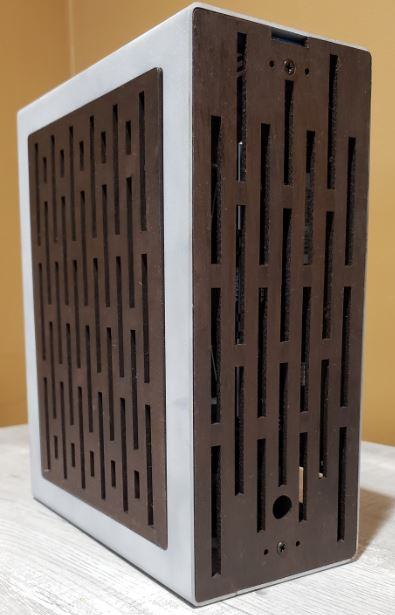

# DUO - Mirrored SFF PC Case

DUO is an open source APU case designed in FreeCAD. Feel free to modify, copy and extend it as you see fit!

For simpler changes to the case, try editing the spreadsheet inside the FreeCAD file. It shouuuld work, probably!

### Status 
- v1 - Complete 
- v2 - In Development

# DUO v2

# DUO v1
This was built to be a slightly oversized show-piece with a glass front panel and custom cables, but I never quite got around to all of that. 

Learned a lot about the FreeCAD workflow, and got a finished prototype, but still not the best design!

- 92mm fan support on top (and bottom if using Pico PSU)
- Flex ATX PSU support (~187 mm)
- Decent CPU cooler support (fits NH-L12s)
- Requires some sort of epoxy or adhesive for attaching inner panels to the shell

